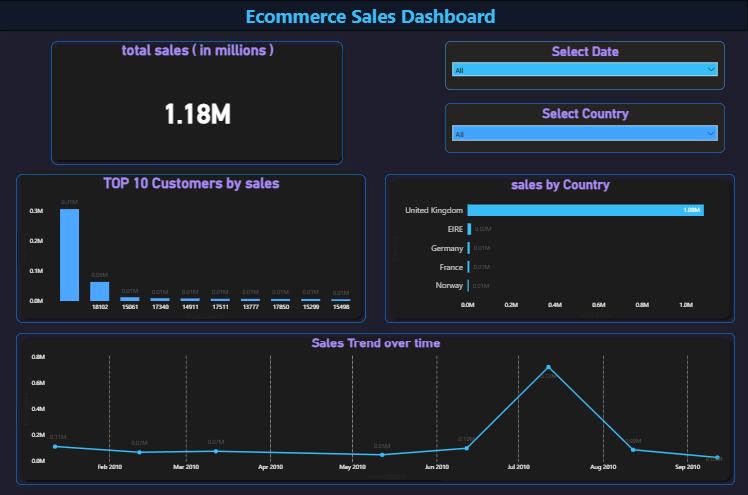

# 📊 Ecommerce Sales Dashboard (Power BI)

## 🔍 Overview
This project is an interactive Power BI dashboard built to analyze ecommerce sales data.  
It provides insights into sales performance, customer trends, and country-wise analysis.

---

## 📸 Dashboard Preview

---

## 📊 Key Insights
- Total Sales: 1.18M
- Top 10 Customers by Sales
- Sales by Country
- Sales Trend over Time

---

## 🛠 Tools & Technologies
- Power BI
- Excel
- DAX

---

## 📁 Project Files
- sales dashboard powerbi 6.pbix → Power BI dashboard file  
- powerbi-dashboard.png → Dashboard screenshot  

---

## 🚀 How to Use
1. Download the .pbix file  
2. Open in Power BI Desktop  
3. Explore the dashboard and interact with filters  

---

## 📌 Author
Ved Prakash
